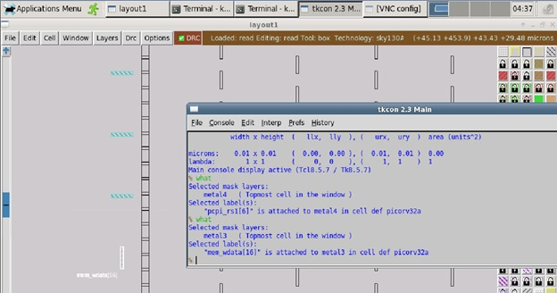

# VLSI-SoC-Physical-Design-Using-OpenSource-EDA-Tools

**Day1 : Inception of Open Source EDA, OpenLANE and SKY130 PDK :**

ASIC Design consist of 3 elements:
1. RTL IP's
2. EDA Tools
3. PDK Data 

PDK (Process Design Kit ) is interface between the FAB and the designer.
It is collection of files used to model a fabrication rocess for EDA Tools used to design an IC

Currently we will be using Google + Skywater Technology based OpenSorce PDK know as Sky130 PDK
Also we will be using OpenSource tool known as OpenLANE which is an automated RTL to GDSII flow based on several components including OpenROAD, Yosys, Magic, Netgen, Fault, OpenPhySyn, SPEF-Extractor and custom methodology scripts for design exploration and optimization. The flow performs full ASIC implementation steps from RTL all the way down to GDSII.

Place and Route (PnR) is the core of any ASIC implementation and Openlane flow integrates into it several key open source tools which perform each of the respective stages of PnR. Below are the stages and the respective tools (in ( )) that are called by openlane for the functionalities as described:

* Synthesis
   * Generating gate-level netlist (yosys).
   * Performing cell mapping (abc).
   * Performing pre-layout STA (OpenSTA).
* Floorplanning
   * Defining the core area for the macro as well as the cell sites and the tracks (init_fp).
   * Placing the macro input and output ports (ioplacer).
   * Generating the power distribution network (pdn).
* Placement
   * Performing global placement (RePLace).
   * Perfroming detailed placement to legalize the globally placed components (OpenDP).
* Clock Tree Synthesis (CTS)
   * Synthesizing the clock tree (TritonCTS).
* Routing
   * Performing global routing to generate a guide file for the detailed router (FastRoute).
   * Performing detailed routing (TritonRoute)
* GDSII Generation
   *Streaming out the final GDSII layout file from the routed def (Magic).

Below is the simplified RTL to GDSII flow 

* Synthesis : Converts RTL to a circuit out of components from Standard Cell library (SCL). Standard Cells have regular layout fixed height width is varaible but discrete.
* Floor and Power Planning : Objective here is to plan silicon area and create robust power distribtion network to power the circuit.
* Chip Floor Planning : Partition the chip die between different system building blocks and place the IO pads.
* Macro Floor Planning : Macro Dimension, pin location and row definition.
* Power Planning : Power network is contructed with multiple VDD and GND lines, such parallel structures are meant to reduce the resistance and hence the IR drop. Uses upper metal layer and hence less resistance.
* Placement : Place the cells on the floorlan rows align within the sites, place close to each other to reduce inter-connect delay and also to enable sucessful routing.
* Clock Tree Sysnthesis (CTS) : Create a clock distribution network to deliver the clock to all sequential elements with minimum skew.
* Routing : Implement the interconnect using available metal layer. Usually done in 2 steps Global Routing and Detailed Routing.
* Sign-off : Physical Verification is carried out sing DRC ( Deisgn Rule Check ) and LVS (Layot verus Schematic ) Check  during this timing verification STA Static Timing Analayis is also carried out.

**OPENLANE**
  * Started as Open Source automated RTL to GDSII flow for a True Open Source Tape Out Experience.
  * Main Goal is to produce clean GDSII with no hman intervention.
  * Tuned for Skywater 130nm Open PDK.
  
  **DAY1_LAB** 
  * OpenLANE directory structure in detail.
  * Design preparation step using following commands 
    ./flow.tcl -interactive : which opens OPENLANE 
    package require openlane 0.9 
    prep -design picorv32a 
    run_sythesis
    
    Design was selected and Synthesis was carried out.
  
  
  
  
  

**Day2 : Floorplan and Library Cells**

**DAY2_LAB**

In this lab follwoing were the stage :
* Stage 1 : 
    * Data preparation stage : 
       Open Openlane  
       How to overwrite the file  
       How to check and set the parameters such as CLOCK PERIOD on fl 
       To run_synthesis 
       
* Stage 2 : Floorlan  
     * To read switches varaibles in floorlan.tcl file  
       To  set the IO mode  
       To knowwhich file is give the priority in terms to set the varaibles (Highest Priority to SKy130A file second Priority to Config.tcl file and lowest priority to floorplan.tcl file located in Openlan_flow/configuration  
       To run_floorplan  
       To open Magic tool to observe the floorplan  
       
Observation in Floorplan :  
1. Inuts and Outputs ins are equidistant  
2. By selecting the Horizontal and vertical pin : we can come to know which metal layer it has 
3. We can observe decap cells at the peripheral of the IO pins
4. We can also observe tap cells : used to avoid latch upconditions in CMOS devices.
5. Standard Cells are located at the lower left corner

* Stage 3 : Placement  
    * run_placement

       

**Day3 : Design Library Cell using Magic Layout and ngSpice Characterization:**

In this lab we clone the CMOS Inverter from vsdstdcelldesign
We check the layot of the design with resect to NMOS MOS and its connections with the metal layers.
Then we extract teh ngsice netlist
We also extract all the parasitic capacitors
We also need to modify the spice deck file according to the gird value NMOS and PMOS definition in the vsdstdcelldesign/libs
Then to simulate the ngSPICE netlist
Characterized the cell using 4 parameters 
1. Rise time delay: Rise time of the Outut waveform from 20% to 80%
2. Fall time delay: Fall time of the Outut Waveform from 80% to 20%
3. Fall Cell delay : It is difference between the time period the output falls to 50% and when input rise to 50%
5. Rise Cell delay : It is difference between the time period the outut rise to 50% and when input falls to 50%

Rise time delay | Fall time delay | Fall Cell delay | Rise Cell delay |
|:---:|:---:|:---:|:---:|
|0.06368nsec|0.042nsec|0.028nsec|0.06nsec|

Day4 : PreLayout Timing Analysis and Clock Tree Synthesis.

Day5 : RTL2GDS using TritonRoute and OpenSTA

