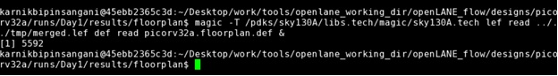
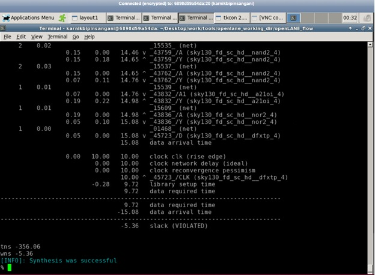

# VLSI-SoC-Physical-Design-Using-OpenSource-EDA-Tools

**Day1 : Inception of Open Source EDA, OpenLANE and SKY130 PDK :**

ASIC Design consist of 3 elements:
1. RTL IP's
2. EDA Tools
3. PDK Data 

PDK (Process Design Kit ) is interface between the FAB and the designer.
It is collection of files used to model a fabrication rocess for EDA Tools used to design an IC

Currently we will be using Google + Skywater Technology based OpenSorce PDK know as Sky130 PDK
Also we will be using OpenSource tool known as OpenLANE which is an automated RTL to GDSII flow based on several components including OpenROAD, Yosys, Magic, Netgen, Fault, OpenPhySyn, SPEF-Extractor and custom methodology scripts for design exploration and optimization. The flow performs full ASIC implementation steps from RTL all the way down to GDSII.

Place and Route (PnR) is the core of any ASIC implementation and Openlane flow integrates into it several key open source tools which perform each of the respective stages of PnR. Below are the stages and the respective tools (in ( )) that are called by openlane for the functionalities as described:

* Synthesis
   * Generating gate-level netlist (yosys).
   * Performing cell mapping (abc).
   * Performing pre-layout STA (OpenSTA).
* Floorplanning
   * Defining the core area for the macro as well as the cell sites and the tracks (init_fp).
   * Placing the macro input and output ports (ioplacer).
   * Generating the power distribution network (pdn).
* Placement
   * Performing global placement (RePLace).
   * Performing detailed placement to legalize the globally placed components (OpenDP).
* Clock Tree Synthesis (CTS)
   * Synthesizing the clock tree (TritonCTS).
* Routing
   * Performing global routing to generate a guide file for the detailed router (FastRoute).
   * Performing detailed routing (TritonRoute)
* GDSII Generation
   *Streaming out the final GDSII layout file from the routed def (Magic).

Below is the simplified RTL to GDSII flow 

* Synthesis : Converts RTL to a circuit out of components from Standard Cell library (SCL). Standard Cells have regular layout fixed height width is varaible but discrete.
* Floor and Power Planning : Objective here is to plan silicon area and create robust power distribtion network to power the circuit.
* Chip Floor Planning : Partition the chip die between different system building blocks and place the IO pads.
* Macro Floor Planning : Macro Dimension, pin location and row definition.
* Power Planning : Power network is contructed with multiple VDD and GND lines, such parallel structures are meant to reduce the resistance and hence the IR drop. Uses upper metal layer and hence less resistance.
* Placement : Place the cells on the floorlan rows align within the sites, place close to each other to reduce inter-connect delay and also to enable sucessful routing.
* Clock Tree Sysnthesis (CTS) : Create a clock distribution network to deliver the clock to all sequential elements with minimum skew.
* Routing : Implement the interconnect using available metal layer. Usually done in 2 steps Global Routing and Detailed Routing.
* Sign-off : Physical Verification is carried out sing DRC ( Deisgn Rule Check ) and LVS (Layot verus Schematic ) Check  during this timing verification STA Static Timing Analayis is also carried out.

**OPENLANE**
  * Started as Open Source automated RTL to GDSII flow for a True Open Source Tape Out Experience.
  * Main Goal is to produce clean GDSII with no hman intervention.
  * Tuned for Skywater 130nm Open PDK.
  
**Main Objective : The goal of the project is to design a single height standard cell and plug this custom cell into a more complex design and perform it's PnR in the openlane flow. The standard cell chosen is a basic CMOS inverter and the design into which it's plugged into is a pre-built picorv32a core.**
  
PicoRV32 is a CPU core that implements the RISC-V RV32IMC Instruction Set. It can be configured as RV32I, RV32IC, RV32IM, or RV32IMC core; where the suffixes stand for:

M - Multiply extension
I - Base Integer Instructions
C - Compressed Instructions
PicoRV32 is free and open hardware licensed under the ISC license.

  **DAY1_LAB** 
  
  * OpenLANE directory structure in detail.
  * Design preparation step using following commands 
    ./flow.tcl -interactive : which opens OPENLANE 
    package require openlane 0.9 
    prep -design picorv32a 
    run_sythesis
    
    Design was selected and Synthesis was carried out.
  
  
  
  
  

**Day2 : Floorplan and Library Cells**

**DAY2_LAB**

In this lab follwoing were the stage :
* Stage 1 : 
    * Data preparation stage : 
       Open Openlane  
       How to overwrite the file  
       How to check and set the parameters such as CLOCK PERIOD on fl 
       To run_synthesis 
       
* Stage 2 : Floorlan  
     * To read switches varaibles in floorlan.tcl file  
       To  set the IO mode  
       To knowwhich file is give the priority in terms to set the varaibles (Highest Priority to SKy130A file second Priority to Config.tcl file and lowest priority to floorplan.tcl file located in Openlan_flow/configuration  
       To run_floorplan  
       To open Magic tool to observe the floorplan  
       
Observation in Floorplan :  
1. Inuts and Outputs ins are equidistant  
2. By selecting the Horizontal and vertical pin : we can come to know which metal layer it has 
3. We can observe decap cells at the peripheral of the IO pins
4. We can also observe tap cells : used to avoid latch upconditions in CMOS devices.
5. Standard Cells are located at the lower left corner

* Stage 3 : Placement  
    * run_placement

       

**Day3 : Design Library Cell using Magic Layout and ngSpice Characterization:**

**DAY3_LAB**

In this lab we clone the CMOS Inverter from vsdstdcelldesign 
We check the layot of the design with resect to NMOS MOS and its connections with the metal layers. 
Then we extract the ngsice netlist 
We also extract all the parasitic capacitors 
We also need to modify the spice deck file according to the gird value NMOS and PMOS definition in the vsdstdcelldesign/libs 
Then to simulate the ngSPICE netlist  
Characterized the cell using 4 parameters  
1. Rise time delay: Rise time of the Outut waveform from 20% to 80%
2. Fall time delay: Fall time of the Outut Waveform from 80% to 20%
3. Fall Cell delay : It is difference between the time period the output falls to 50% and when input rise to 50%
5. Rise Cell delay : It is difference between the time period the outut rise to 50% and when input falls to 50%

Rise time delay | Fall time delay | Fall Cell delay | Rise Cell delay |
|:---:|:---:|:---:|:---:|
|0.06368nsec|0.042nsec|0.028nsec|0.06nsec|

**Day4 : PreLayout Timing Analysis and Clock Tree Synthesis:**

**DAY4_LAB**

1. We convert grid info into the track info
2. To include the standard cell into the design we dont require PWR, GND, Port information, Logic part.
3. The only information we require is inner boundary of the cell, PWR  GND and Inut and Output Port.
4. LEF (Library Echange format) comes into picture  LEF file has these information.
5. LEF file protect the IP's logic.
6. For PnR we need to make follwoing guidelines to make the Standard cell set
  * Input and Output ports must lie on the intersection of vertical and horizontal tracks.
  * The width of the standard cell shold be odd multiple of track horizontal pitch and height should be odd multiple of track vertical pitch.
7.Converge grid definition to track definition.
8.Define the Ports  as pins of the macro.
9. Next objective will be what is the purpose of the port means how doe the tool know that A is input port and Y is output port, VPWR is power and VGND is ground these definition has to be done using **port class and ort use**.
10.Now extract the LEF file and plug this file the the design file.
11. In the Openlane Flow we need to include our custom cell and 1st stage in OpenLane is snythesis the ABC flo of the synthesis mst ma the netlist to the cells int he library so we need to have the libray which our cell definition for synthesis.
12. Before synthesis add and merge the LEF files 
./flow.tcl -interactive 
package require openlane 0.9 
prep -design picorv32a  -tay Day2 -overwrite 
set lefs [glob $::env(DESIGN_DIR)/src/*.lef] 
add_lefs -src $lefs 
run_sythesis 
Once we run the synthesis we can observe the huge slack 

Slack | tns (total negative slack) | wns (worst negative slack)|
|:---:|:---:|:---:|
|-17.96|-2593.43|-17.96|

12. Configure the Synthesis setting to fix the slack 
So after synthesis set follwoing parameters 
SYNTH_STRATEGY = 1 
SYNTH_BUFFERING = 1 
SYNTH_SIZING = 1 
SYNTH-DRIVING_CELL = sky130_fd_sc_hd_inv8 
run_synthesis again and observe the slack as below ( has a hude improvement ) 

Slack | tns (total negative slack) | wns (worst negative slack)|
|:---:|:---:|:---:|
|-5.36|-356.06|-5.36|

run_floorplan 
run_placement 
Open the Magic tool 

13. Now we configure OpenSTA for post STA 
If there is timing violatin we carry out analysis in separate tool 
run sta for pre sta 
We can observe similar results as above  

Slack | tns (total negative slack) | wns (worst negative slack)|
|:---:|:---:|:---:|
|-5.36|-356.06|-5.36|

14. Optimization of the Fanout value 
After placement, set SYNTH_MAX_FANOUT = 4  
run_synthesis  

Slack | tns (total negative slack) | wns (worst negative slack)|
|:---:|:---:|:---:|
|-3.76|-96.76|-3.76|

15. After Sythensis again we erforme is pre STA 
PnR is iterative flow were we try to redce the slack to Zero or positive value. 
So after scaling the we get follwoing Slack 

Slack | tns (total negative slack) | wns (worst negative slack)|
|:---:|:---:|:---:|
|-2.5175|-72.97|-2.52|

16. Now we want these modifications to be reflected to the Netlist 
write the verilog file  
We should run the synthesis again as we have changed the netlist 
run_floorlan 
run_placement 

17. Now net ste is CTS kindly check the switch varaible and the run_cts 
In CTS clock buffers gets added so that modifies the netlist.

18. Perform Timing analysis using OpenSTA  
OpenRoad 
Create DB read lef and def files and rhen write and read DB file 
Read MIN and MAX liberary  
We can observe following Setp Time and Hold Time 

Setup Slack | Hold Slack | 
|:---:|:---:|
|-2.70|-1.196|

19.Hold Slack and Setup Slack has to be rectified 
The analysis performed is incorrect because we have built the clock tree for Tyical corner and the library which we are using the MIN and MAX lirary for MIN and MAX corner 
We need to inculde libraries for the tyical analysis. 
Once we perform that we get positive Setu Slack and postiive Hold slack

Setup Slack | Hold Slack | 
|:---:|:---:|
|2.8469|0.2547|

Thus for the Typical Corner both are meet.

**Day5 : RTL2GDS using TritonRoute and OpenSTA**

**DAY5_LAB**

Power Distribution network is built and Routing is carried out 
gen_pdn 
Identify the roting strategy  
run_routing 
Number of Violations is 3 
Now to run Post routing STA  1st goal is to extract the parasitics 
Once the paratics are extracted, run the post STA.

**Limitations**

At present, Openlane has following limitations: 

Limited Timing Constraints. 
Timing Closure. 
No post-routing optimization 

**Acknowledgements**

Kunal Ghosh, Co-founder (VSD Corp. Pvt. Ltd) 
Nickson Jose ( VSD Team ) 
And Entire VSD Team  Thanks for all the support 

